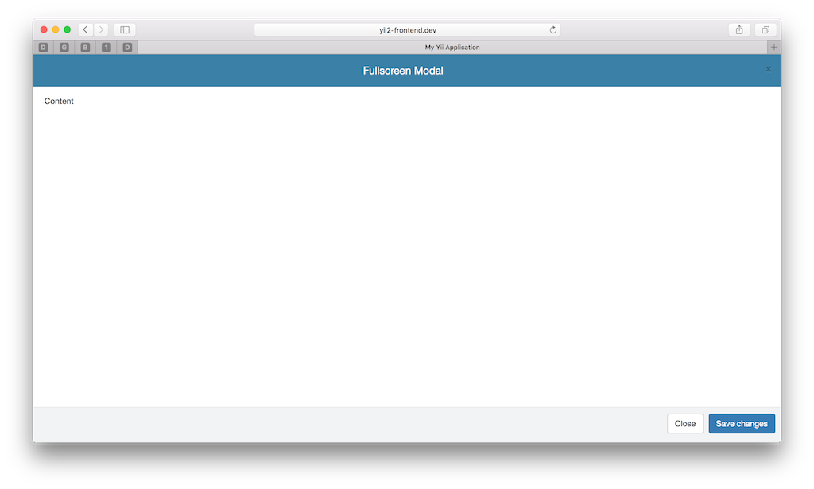

Yii2 Fullscreen Modal
=====================
[](https://packagist.org/packages/yii2assets/yii2-fullscreen-modal) [](https://packagist.org/packages/yii2assets/yii2-fullscreen-modal) [](https://packagist.org/packages/yii2assets/yii2-fullscreen-modal) [](https://packagist.org/packages/yii2assets/yii2-fullscreen-modal) [](https://packagist.org/packages/yii2assets/yii2-fullscreen-modal)

Bootstrap fullscreen modal

Installation
------------

The preferred way to install this extension is through [composer](http://getcomposer.org/download/).

Either run

```
php composer.phar require --prefer-dist yii2assets/yii2-fullscreen-modal "*"
```

or add

```
"yii2assets/yii2-fullscreen-modal": "*"
```

to the require section of your `composer.json` file.


Usage
-----

Once the extension is installed, simply use it in your code by  :

```php

<?php \yii2assets\fullscreenmodal\FullscreenModal::begin([
   'header' => '<h4 class="modal-title text-center">Fullscreen Modal</h4>',
   'footer' => '<button type="button" class="btn btn-default" data-dismiss="modal">Close</button>
               <button type="button" class="btn btn-primary">Save changes</button>',

   'toggleButton' => ['label' => 'Open','class'=>'btn btn-primary'],
]);?>

<p> Content </p>

<?php FullscreenModal::end();?>

```


